# Assignment 3   Data Visualization with Python
<b>Skill Development Lab</b>


## By Yagnik Bhargav
#### PRN : 17070122077  ----- CS-3


```python
import pandas as pd
import matplotlib.pyplot as plt
import seaborn as sns
plt.style.use('fivethirtyeight')
```


```python
dic= pd.read_csv('archive/dictionary.csv')
summer=pd.read_csv('archive/summer.csv')
winter=pd.read_csv('archive/winter.csv')
```


```python
dic.head()
```


<div>
<style scoped>
    .dataframe tbody tr th:only-of-type {
        vertical-align: middle;
    }

    .dataframe tbody tr th {
        vertical-align: top;
    }

    .dataframe thead th {
        text-align: right;
    }
</style>
<table border="1" class="dataframe">
  <thead>
    <tr style="text-align: right;">
      <th></th>
      <th>Country</th>
      <th>Code</th>
      <th>Population</th>
      <th>GDP per Capita</th>
    </tr>
  </thead>
  <tbody>
    <tr>
      <th>0</th>
      <td>Afghanistan</td>
      <td>AFG</td>
      <td>32526562.0</td>
      <td>594.323081</td>
    </tr>
    <tr>
      <th>1</th>
      <td>Albania</td>
      <td>ALB</td>
      <td>2889167.0</td>
      <td>3945.217582</td>
    </tr>
    <tr>
      <th>2</th>
      <td>Algeria</td>
      <td>ALG</td>
      <td>39666519.0</td>
      <td>4206.031232</td>
    </tr>
    <tr>
      <th>3</th>
      <td>American Samoa*</td>
      <td>ASA</td>
      <td>55538.0</td>
      <td>NaN</td>
    </tr>
    <tr>
      <th>4</th>
      <td>Andorra</td>
      <td>AND</td>
      <td>70473.0</td>
      <td>NaN</td>
    </tr>
  </tbody>
</table>
</div>


```python
summer=summer.rename(columns={"Country": "Code"})
```


```python
winter=winter.rename(columns={"Country": "Code"})
```


```python
summer=pd.merge(summer,dic,how='left',on='Code')
```


```python
winter=pd.merge(winter,dic,how='left',on='Code')
```


```python
summer.head()
```


<div>
<style scoped>
    .dataframe tbody tr th:only-of-type {
        vertical-align: middle;
    }

    .dataframe tbody tr th {
        vertical-align: top;
    }

    .dataframe thead th {
        text-align: right;
    }
</style>
<table border="1" class="dataframe">
  <thead>
    <tr style="text-align: right;">
      <th></th>
      <th>Year</th>
      <th>City</th>
      <th>Sport</th>
      <th>Discipline</th>
      <th>Athlete</th>
      <th>Code</th>
      <th>Gender</th>
      <th>Event</th>
      <th>Medal</th>
      <th>Country</th>
      <th>Population</th>
      <th>GDP per Capita</th>
    </tr>
  </thead>
  <tbody>
    <tr>
      <th>0</th>
      <td>1896</td>
      <td>Athens</td>
      <td>Aquatics</td>
      <td>Swimming</td>
      <td>HAJOS, Alfred</td>
      <td>HUN</td>
      <td>Men</td>
      <td>100M Freestyle</td>
      <td>Gold</td>
      <td>Hungary</td>
      <td>9844686.0</td>
      <td>12363.543460</td>
    </tr>
    <tr>
      <th>1</th>
      <td>1896</td>
      <td>Athens</td>
      <td>Aquatics</td>
      <td>Swimming</td>
      <td>HERSCHMANN, Otto</td>
      <td>AUT</td>
      <td>Men</td>
      <td>100M Freestyle</td>
      <td>Silver</td>
      <td>Austria</td>
      <td>8611088.0</td>
      <td>43774.985174</td>
    </tr>
    <tr>
      <th>2</th>
      <td>1896</td>
      <td>Athens</td>
      <td>Aquatics</td>
      <td>Swimming</td>
      <td>DRIVAS, Dimitrios</td>
      <td>GRE</td>
      <td>Men</td>
      <td>100M Freestyle For Sailors</td>
      <td>Bronze</td>
      <td>Greece</td>
      <td>10823732.0</td>
      <td>18002.230578</td>
    </tr>
    <tr>
      <th>3</th>
      <td>1896</td>
      <td>Athens</td>
      <td>Aquatics</td>
      <td>Swimming</td>
      <td>MALOKINIS, Ioannis</td>
      <td>GRE</td>
      <td>Men</td>
      <td>100M Freestyle For Sailors</td>
      <td>Gold</td>
      <td>Greece</td>
      <td>10823732.0</td>
      <td>18002.230578</td>
    </tr>
    <tr>
      <th>4</th>
      <td>1896</td>
      <td>Athens</td>
      <td>Aquatics</td>
      <td>Swimming</td>
      <td>CHASAPIS, Spiridon</td>
      <td>GRE</td>
      <td>Men</td>
      <td>100M Freestyle For Sailors</td>
      <td>Silver</td>
      <td>Greece</td>
      <td>10823732.0</td>
      <td>18002.230578</td>
    </tr>
  </tbody>
</table>
</div>


```python
winter.head()
```


<div>
<style scoped>
    .dataframe tbody tr th:only-of-type {
        vertical-align: middle;
    }

    .dataframe tbody tr th {
        vertical-align: top;
    }

    .dataframe thead th {
        text-align: right;
    }
</style>
<table border="1" class="dataframe">
  <thead>
    <tr style="text-align: right;">
      <th></th>
      <th>Year</th>
      <th>City</th>
      <th>Sport</th>
      <th>Discipline</th>
      <th>Athlete</th>
      <th>Code</th>
      <th>Gender</th>
      <th>Event</th>
      <th>Medal</th>
      <th>Country</th>
      <th>Population</th>
      <th>GDP per Capita</th>
    </tr>
  </thead>
  <tbody>
    <tr>
      <th>0</th>
      <td>1924</td>
      <td>Chamonix</td>
      <td>Biathlon</td>
      <td>Biathlon</td>
      <td>BERTHET, G.</td>
      <td>FRA</td>
      <td>Men</td>
      <td>Military Patrol</td>
      <td>Bronze</td>
      <td>France</td>
      <td>66808385.0</td>
      <td>36205.568102</td>
    </tr>
    <tr>
      <th>1</th>
      <td>1924</td>
      <td>Chamonix</td>
      <td>Biathlon</td>
      <td>Biathlon</td>
      <td>MANDRILLON, C.</td>
      <td>FRA</td>
      <td>Men</td>
      <td>Military Patrol</td>
      <td>Bronze</td>
      <td>France</td>
      <td>66808385.0</td>
      <td>36205.568102</td>
    </tr>
    <tr>
      <th>2</th>
      <td>1924</td>
      <td>Chamonix</td>
      <td>Biathlon</td>
      <td>Biathlon</td>
      <td>MANDRILLON, Maurice</td>
      <td>FRA</td>
      <td>Men</td>
      <td>Military Patrol</td>
      <td>Bronze</td>
      <td>France</td>
      <td>66808385.0</td>
      <td>36205.568102</td>
    </tr>
    <tr>
      <th>3</th>
      <td>1924</td>
      <td>Chamonix</td>
      <td>Biathlon</td>
      <td>Biathlon</td>
      <td>VANDELLE, André</td>
      <td>FRA</td>
      <td>Men</td>
      <td>Military Patrol</td>
      <td>Bronze</td>
      <td>France</td>
      <td>66808385.0</td>
      <td>36205.568102</td>
    </tr>
    <tr>
      <th>4</th>
      <td>1924</td>
      <td>Chamonix</td>
      <td>Biathlon</td>
      <td>Biathlon</td>
      <td>AUFDENBLATTEN, Adolf</td>
      <td>SUI</td>
      <td>Men</td>
      <td>Military Patrol</td>
      <td>Gold</td>
      <td>Switzerland</td>
      <td>8286976.0</td>
      <td>80945.079219</td>
    </tr>
  </tbody>
</table>
</div>


## Plot Medals won each year from 1896 (Summer Olympics)


```python
summer.groupby(['Year'])['Medal'].value_counts().unstack().plot.bar(stacked=True,figsize=(13,7))
plt.title('Medals won each year from 1896 Summer Olympics')
plt.ylabel('No.of Medals')
```


    Text(0, 0.5, 'No.of Medals')


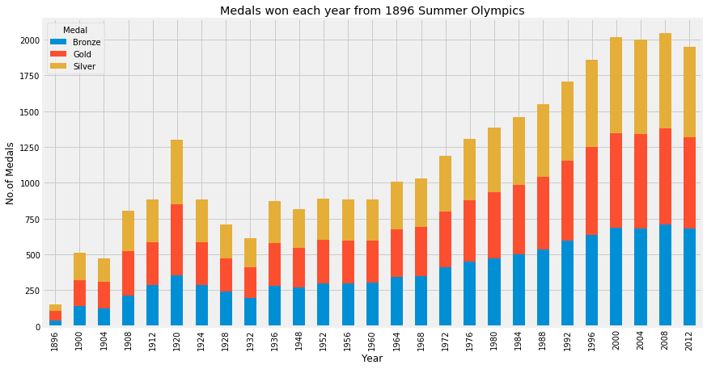


## Plot Medals won each year from 1924 (Winter Olympics)


```python
winter.groupby(['Year'])['Medal'].value_counts().unstack().plot.bar(stacked=True,figsize=(13,7))
plt.title('Medals won each year from 1924 Winter Olympics')
plt.ylabel('No.of Medals')
```


    Text(0, 0.5, 'No.of Medals')


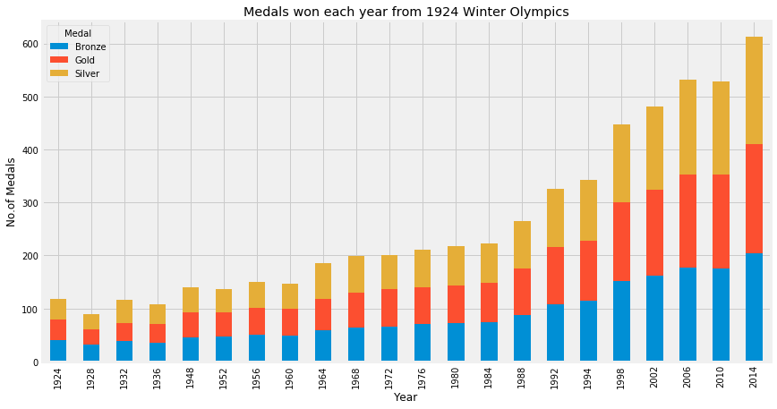


## Plot of Medals won by top 20 Countries in Summer Olympics


```python
medals_country=summer.groupby(['Country','Medal'])['Gender'].count().reset_index().sort_values(by='Gender',ascending=False)
medals_country=medals_country.pivot('Country','Medal','Gender').fillna(0)
top=medals_country.sort_values(by='Gold',ascending=False)[:20]
top.plot.bar(stacked=True,figsize=(13,7))
plt.title('Medals Distribution Of Top 20 Countries (Summer Olympics)')
plt.ylabel('No. of Medals')
plt.show()
```


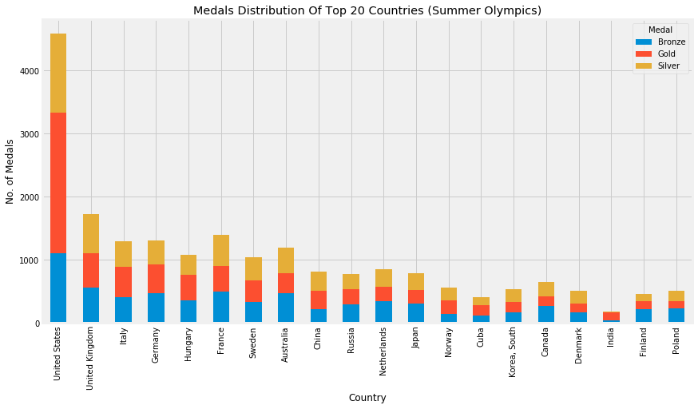


<div style="page-break-after: always;"></div>
<div>&nbsp;
</div>

## Plot of Medals won by top 20 Countries in Winter Olympics


```python
medals_country=winter.groupby(['Country','Medal'])['Gender'].count().reset_index().sort_values(by='Gender',ascending=False)
medals_country=medals_country.pivot('Country','Medal','Gender').fillna(0)
top=medals_country.sort_values(by='Gold',ascending=False)[:20]
top.plot.bar(stacked=True,figsize=(13,7))
plt.title('Medals Distribution Of Top 20 Countries (Winter Olympics)')
plt.ylabel('No.of Medals')
plt.show()
```


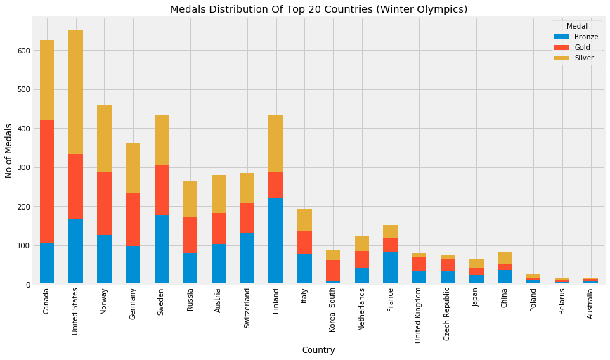


<div style="page-break-after: always;"></div>
<div>&nbsp;
</div>

## Plot of Medals won by top 10 Countries in Summer Olympics in respective games


```python
x=summer[summer['Country'].isin(summer['Country'].value_counts()[:10].index)].groupby(['Country','Sport'])['Year'].count().unstack().fillna(0)
plt.figure(figsize=(25,10))
sns.heatmap(x, annot=True, linewidths=0.1,fmt='0.1f')
b, t = plt.ylim() # discover the values for bottom and top
b += 0.5 # Add 0.5 to the bottom
t -= 0.5 # Subtract 0.5 from the top
plt.ylim(b, t) # update the ylim(bottom, top) values
plt.title('Medals in each sport by Top 10 countries (Summer Olympics) ')
plt.show() # ta-da!
```


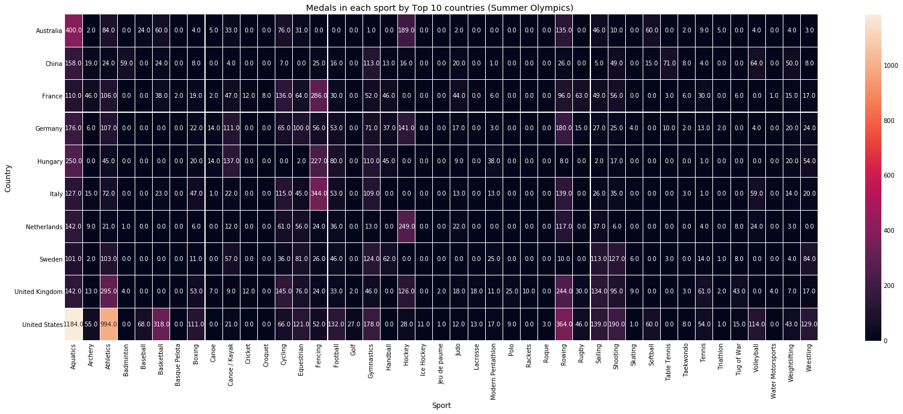


<p style="page-break-after:always;"></p>

## Plot of Medals won by top 10 Countries in Winter Olympics in respective games


```python
x=winter[winter['Country'].isin(winter['Country'].value_counts()[:10].index)].groupby(['Country','Sport'])['Year'].count().unstack().fillna(0)
plt.figure(figsize=(25,15))
sns.heatmap(x, annot=True, linewidths=0.1,fmt='0.1f')
b, t = plt.ylim() # discover the values for bottom and top
b += 0.5 # Add 0.5 to the bottom
t -= 0.5 # Subtract 0.5 from the top
plt.ylim(b, t) # update the ylim(bottom, top) values
plt.title('Medals in each sport by Top 10 countries (Winter Olympics) ')
plt.show() # ta-da!
```


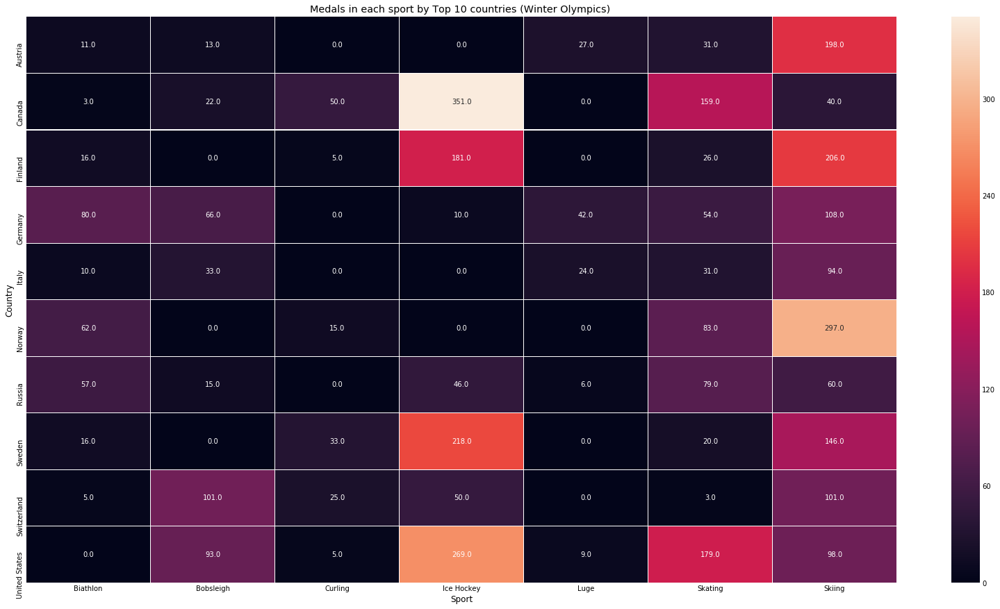


<p style="page-break-after:always;"></p>

## Plot of no. of medals won by Top Male Atheletes in Summer Olympics


```python
men=summer[summer['Gender']=='Men']
men=men.groupby(['Athlete','Medal'])['Code'].count().reset_index().sort_values(by='Code',ascending=False)
men=men[men['Athlete'].isin(summer['Athlete'].value_counts().index[:15])]
men=men.pivot('Athlete','Medal','Code')
men.plot.barh(figsize=(13,7))
plt.title('Top Male Achievers in Summer Olympics ')
plt.ylabel('Athlete')
```


    Text(0, 0.5, 'Athlete')


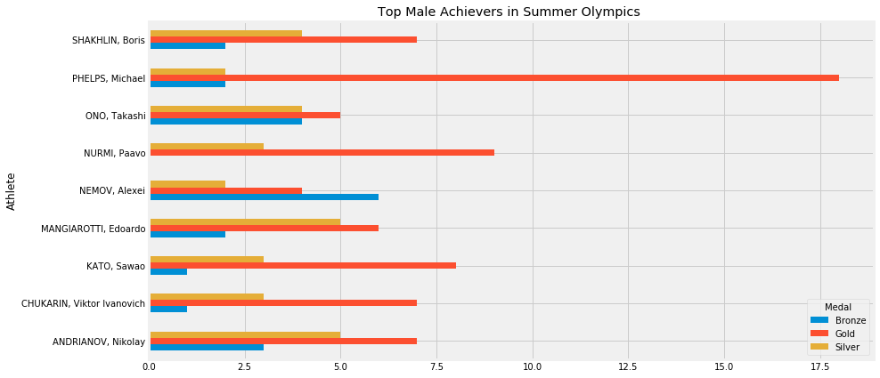


<p style="page-break-after:always;"></p>

## Plot of no. of medals won by Top Female Atheletes in Summer Olympics


```python
women=summer[summer['Gender']=='Women']
women=women.groupby(['Athlete','Medal'])['Code'].count().reset_index().sort_values(by='Code',ascending=False)
women=women[women['Athlete'].isin(summer['Athlete'].value_counts().index[:20])]
women=women.pivot('Athlete','Medal','Code')
women.plot.barh(figsize=(13,7))
plt.title('Best Female Athletes (Summer Olympics) ')
plt.ylabel('Athlete')
```


    Text(0, 0.5, 'Athlete')


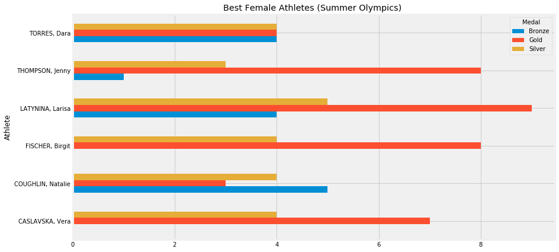


<p style="page-break-after:always;"></p>

## Plot of no. of medals won by Top Male Atheletes in Winter Olympics


```python
men=winter[winter['Gender']=='Men']
men=men.groupby(['Athlete','Medal'])['Code'].count().reset_index().sort_values(by='Code',ascending=False)
men=men[men['Athlete'].isin(winter['Athlete'].value_counts().index[:15])]
men=men.pivot('Athlete','Medal','Code')
men.plot.barh(figsize=(13,7))
plt.title('Best Male Athletes (Winter Olympics) ')
plt.ylabel('Athlete')
```


    Text(0, 0.5, 'Athlete')


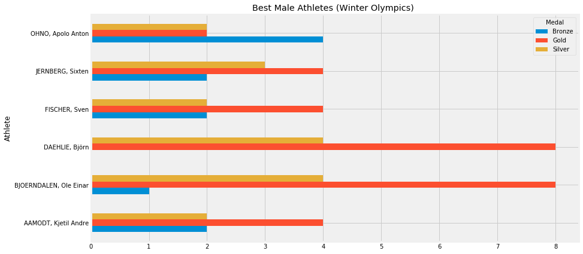


<p style="page-break-after:always;"></p>

## Plot of no. of medals won by Top Female Atheletes in Winter Olympics


```python
women=winter[winter['Gender']=='Women']
women=women.groupby(['Athlete','Medal'])['Code'].count().reset_index().sort_values(by='Code',ascending=False)
women=women[women['Athlete'].isin(winter['Athlete'].value_counts().index[:20])]
women=women.pivot('Athlete','Medal','Code')
women.plot.barh(figsize=(13,7))
plt.title('Best Female Athletes (Winter Olympics) ')
plt.ylabel('Athlete')
```


    Text(0, 0.5, 'Athlete')


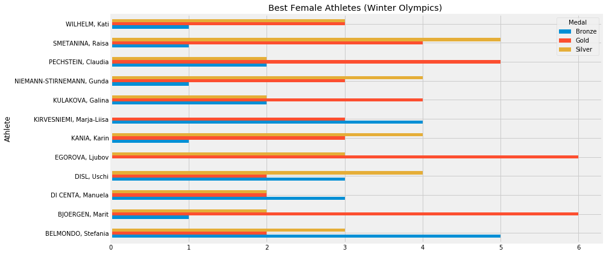


<p style="page-break-after:always;"></p>

## Distribution of no. of Gold, Silver and Bronze won by India


```python
summer.groupby(['Code'])['Medal'].value_counts()['IND'].plot(kind='pie')
plt.title('Medals Won By India in Olympics')
```


    Text(0.5, 1.0, 'Medals Won By India in Olympics')


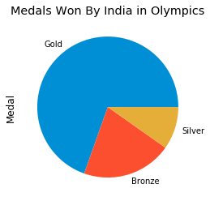


<p style="page-break-after:always;"></p>

## Plot of no. of different medals won by Indian men over years


```python
# Growth of Indian medals
ind = summer[(summer['Gender']=='Men')&(summer['Country']=='India')]
ind.groupby(['Year'])['Medal'].value_counts().unstack().plot(figsize=(13,7))
plt.title('Indian Mens Performance at Summer Olympics')
plt.ylabel('No of Medals')

```


    Text(0, 0.5, 'No of Medals')


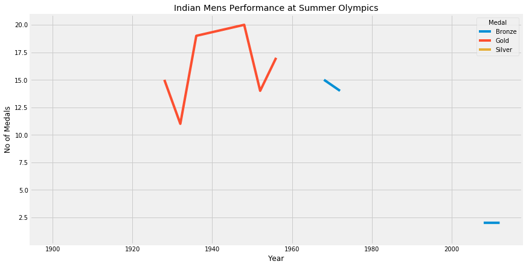


<p style="page-break-after:always;"></p>

## Plot of no. of different medals won by Indian women over years


```python
# Growth of Indian medals
ind = summer[(summer['Gender']=='Women')&(summer['Country']=='India')]
ind.groupby(['Year'])['Medal'].value_counts().unstack().plot(figsize=(13,7))
plt.title('Indian Womens Performance at Summer Olympics')
plt.ylabel('No of Medals')

```


    Text(0, 0.5, 'No of Medals')


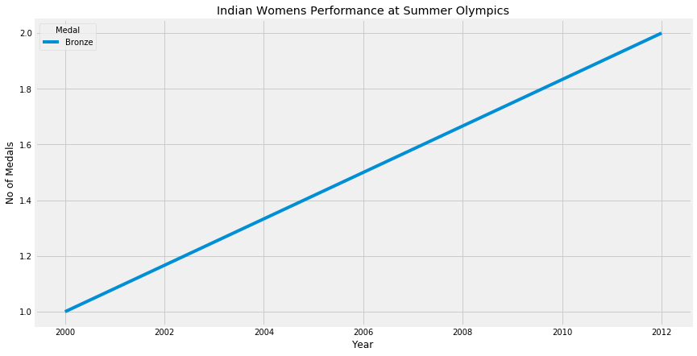


<p style="page-break-after:always;"></p>

## Plot of no. of different medals won by Indian men in different games


```python
# Growth of Indian medals
ind = summer[(summer['Gender']=='Men')&(summer['Country']=='India')]
ind.groupby(['Sport'])['Medal'].value_counts().unstack().plot.barh(figsize=(13,7))
plt.title('Indian Mens Gameswise distribution of Medals at Summer Olympics')
plt.ylabel('Sport')
plt.xlabel('No. of Medals')

```


    Text(0.5, 0, 'No. of Medals')


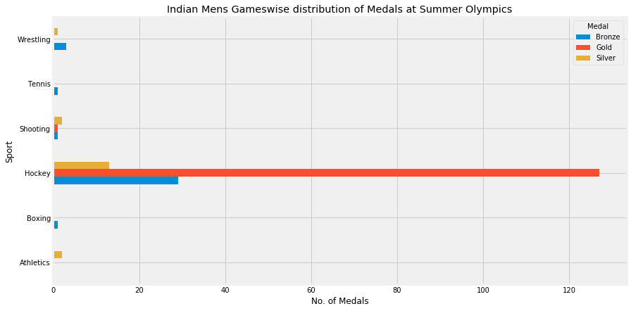


<p style="page-break-after:always;"></p>

## Plot of no. of different medals won by Indian women in different games


```python
ind = summer[(summer['Gender']=='Women')&(summer['Country']=='India')]
ind.groupby(['Sport'])['Medal'].value_counts().unstack().plot.barh(figsize=(13,7))
plt.title('Indian Womens Gameswise distribution of Medals at Summer Olympics')
plt.ylabel('Sport')
plt.xlabel('No. of Medals')

```


    Text(0.5, 0, 'No. of Medals')


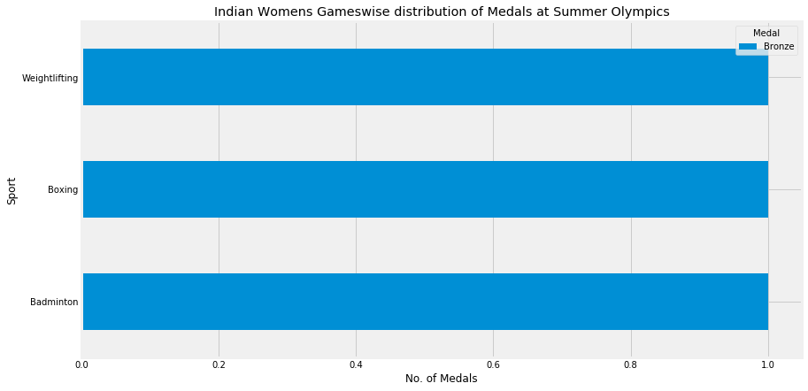


<p style="page-break-after:always;"></p>

## Plot of no. of different medals won by US men in different games


```python
ind = summer[(summer['Gender']=='Men')&(summer['Country']=='United States')]
ind.groupby(['Sport'])['Medal'].value_counts().unstack().plot.barh(figsize=(13,7))
plt.title('US Mens Gameswise distribution of Medals at Summer Olympics')
plt.ylabel('Sport')
plt.xlabel('No. of Medals')

```


    Text(0.5, 0, 'No. of Medals')


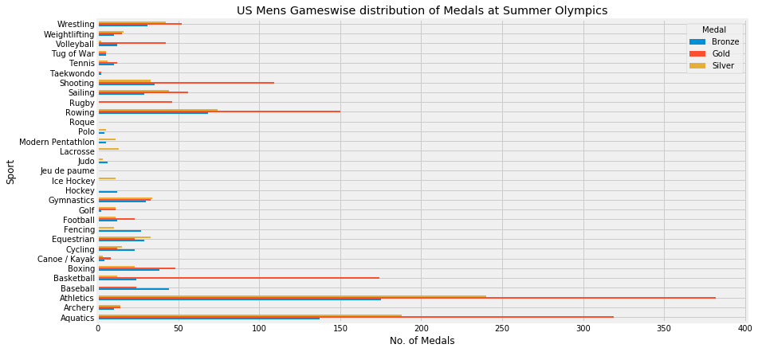


<p style="page-break-after:always;"></p>

## Plot of no. of different medals won by US women in different games


```python
ind = summer[(summer['Gender']=='Women')&(summer['Country']=='United States')]
ind.groupby(['Sport'])['Medal'].value_counts().unstack().plot.barh(figsize=(13,7))
plt.title('US Womens Gameswise distribution of Medals at Summer Olympics')
plt.ylabel('Sport')
plt.xlabel('No. of Medals')

```


    Text(0.5, 0, 'No. of Medals')


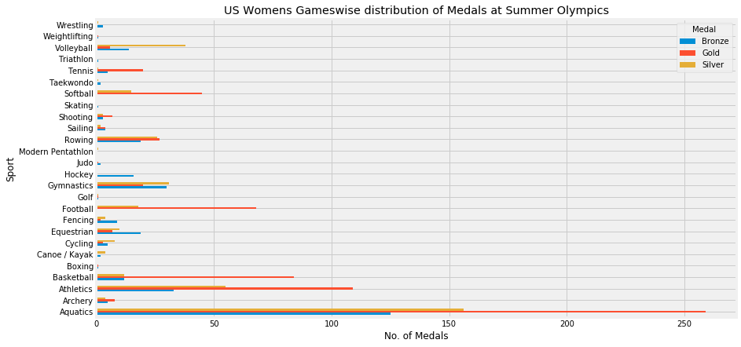


<p style="page-break-after:always;"></p>

## Plot of no. of different medals won by US men in over years


```python
ind = summer[(summer['Gender']=='Men')&(summer['Country']=='United States')]
ind.groupby(['Year'])['Medal'].value_counts().unstack().plot(figsize=(13,7))
plt.title('US Mens Performance at Summer Olympics')
plt.ylabel('No of Medals')

```


    Text(0, 0.5, 'No of Medals')


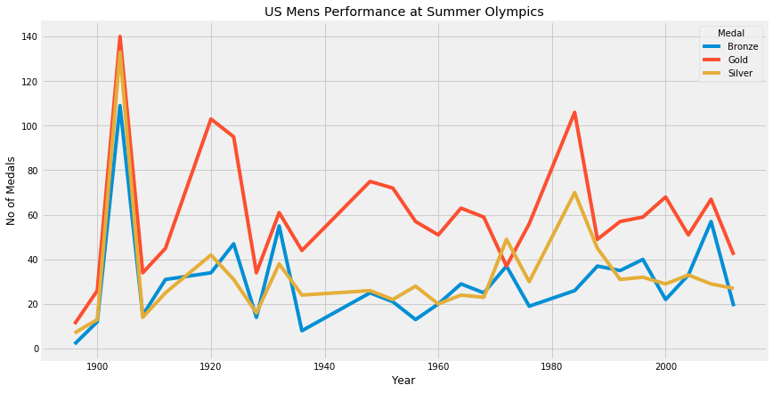


<p style="page-break-after:always;"></p>

## Plot of no. of different medals won by US women in over years


```python
ind = summer[(summer['Gender']=='Women')&(summer['Country']=='United States')]
ind.groupby(['Year'])['Medal'].value_counts().unstack().plot(figsize=(13,7))
plt.title('US Womens Performance at Summer Olympics')
plt.ylabel('No of Medals')

```


    Text(0, 0.5, 'No of Medals')


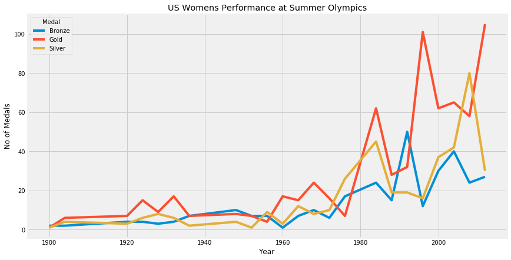


---
